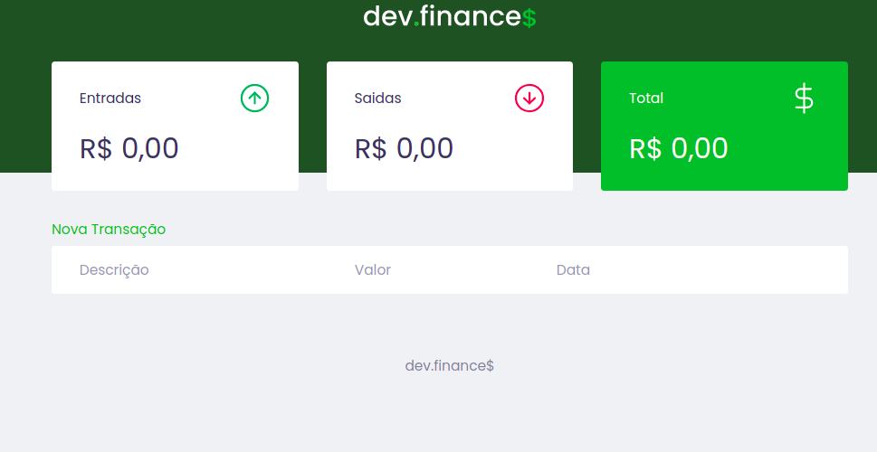
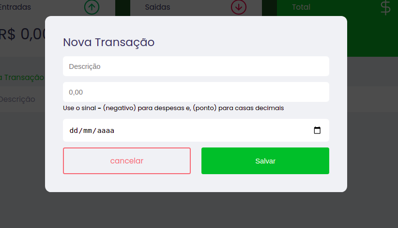

## DEV-FINANCE
  Uma Aplicação utilizada para controle de finças
  onde é possivel adiocionar as receitas e as
  despesas e vsualizar em nos paineis em forma
  de card as somas dos valores de entrada,
  saida e total, alem de uma tabela mostrando o 
  istorico das movimentações

## TECNOLOGIAS UTILIZADAS
    * Html
    * Css
    * JavaScript

## DESENVOLVIMENTO
    Essa aplição foi desenvolvida durante a
    maratona Discover; um evento reaizado pela
    Rocketseat com foco naqulesque estão 
    iniciando no mundo da programação.
##LINK
    https://vercel.com/maciel-coder/dev-finance#:~:text=dev%2Dfinance%2D9ypq1oq1t%2Dmaciel%2Dcoder.vercel.app
  

 ### Tela Principal
  
### Tela de ormulario
  

 
